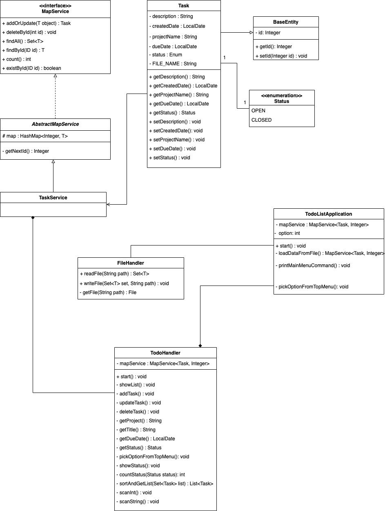

# Introduction
Todo-List application is a Text Based User Interface via the command-line. The application will allow a user to create 
new tasks, assign them a title, due date, and choose a project for that task to belong to. The user can also also edit,
mark task as done or remove tasks. They can also quit and save the current task list to file, and then restart the 
application with the former state restored.

# Requirements
* Java 8 or above

# Class Diagram

