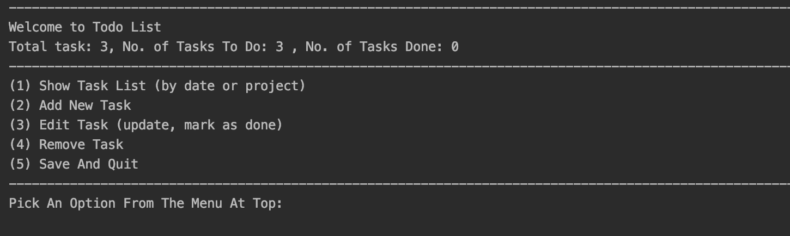
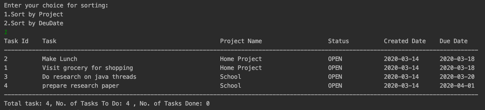
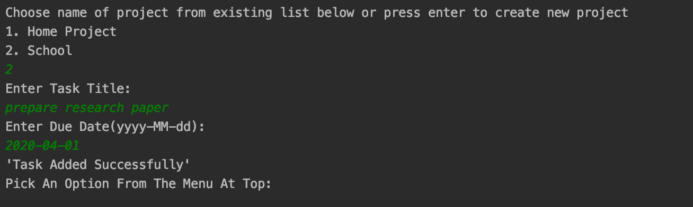
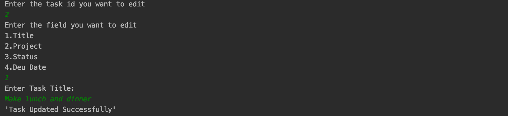
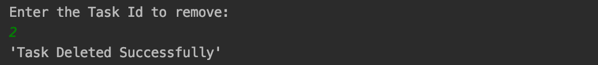

# Introduction
Todo-List application is a Text Based User Interface via the command-line. The application will allow user to create 
project, new tasks, assign them a title, status, due date, and place task under a project. The user can also 
also edit, mark task as done or remove tasks. They can also quit and save the current task list to file, and then 
restart the application with the former state restored.

# Requirements
* Java 8 or above

# Class Diagram

# Features
This program utilizes file to read and write object. The program automatically creates a new file at the given 
path. If file with given name already exists, then uses the same file for further operations. Current state of 
the lists can be saved to file. On restart, the program restores the list to the former state. 

## Menu
List of operation that can be performed on todo-list is displayed.

## Display Todo List
User can view all the tasks with details and see how many tasks are "open" or "done" by selecting option (1). 
Feature to sort the list by due date or by project name is also available.

## Adding New Task
Choose option (2) to add new task. List of existing project will be shown if present. User can add 
new task to existing project or create new project to add task.

## Editing Task
Choose option (3) to update the task. Enter the corresponding task no to edit. Then choose the 
field that you want to edit.

## Remove Task
Choose option (4) to delete a task. It will ask for the corresponding task no that has to be deleted.

## Save And Quit
Choose option (5) to save and exit from program. The actions performed on todo lists are saved to file.

**Note: If program exit before saving, then the current state of list will not be written to the file.**
